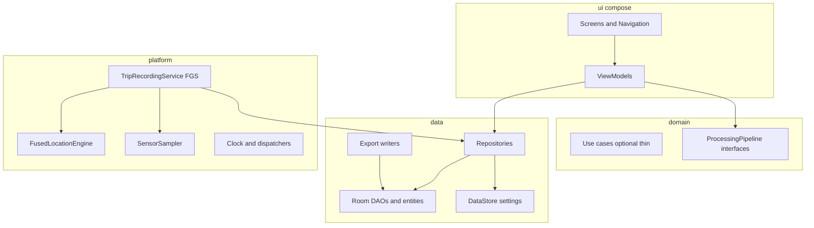

# OLGX Roads — Android v1 implementation plan

## Build status (Phase 0 / 1)

**Implemented in repo (Phase 0 / 1):** Gradle Kotlin DSL + `:app` module, Compose (M3) + Navigation, Hilt, Room schema/DAOs, DataStore settings, Home/Settings/Diagnostics screens, initial unit tests (Room, ViewModel; DataStore via Robolectric).

**Final amendments (locked for Phase 0/1 code):**

- Global **`passive_collection_enabled`** (capture policy; default ON after onboarding consent; user-controllable in Settings). Distinct from upload toggles.
- Explicit separation **capture policy** vs **upload policy** in settings and in session policy snapshot fields.
- Local storage safety placeholders: **`retention_days`**, **`max_local_storage_mb`**, **`local_compaction_enabled`** (no destructive cleanup logic yet; architecture + settings only).
- **Road eligibility is conservative:** never hard-delete samples from early heuristics on-device; retain and flag `road_eligibility` / quality; defer discard to later processing/export.

## Current repository baseline

- [README.md](c:/cursor-dev/roads/README.md): strong mission, phased IRI stance, MVP bullet list, and a suggested folder layout (not yet on disk).
- [LICENSE](c:/cursor-dev/roads/LICENSE): **MIT** (already chosen). Plan assumes **retain MIT** unless the project needs copyleft for council compliance (unlikely for an app library).

**Assumption:** Greenfield Android project under `app/`; Gradle Kotlin DSL; `minSdk` likely **26+** (practical for modern sensors/notification channels) with **targetSdk 35** (current stable policy); exact `minSdk` is an open decision below.

---

## Recommended architecture

**Style:** Clean-ish layers **inside one Gradle module** (`:app`) using packages, not premature multi-module extraction.



**Unidirectional data flow:**

- UI events → ViewModel → repository/service APIs.
- State via `StateFlow` / `UiState` data classes; avoid bidirectional binding.
- **Trip active truth** lives in service + DB: ViewModels observe DB (and bound service binder if needed) rather than duplicating recorder state only in memory.

**Why single module now:** Faster iteration in Android Studio/Cursor, simpler dependency graph, easier field APK sharing. Split later along natural seams: `:core:domain` (pure Kotlin), `:core:data` (Room), `:feature:trip` only when build times or team size force it.

---

## Project structure (recommended on disk)

Keep your README’s spirit but flatten slightly for v1 engineers:

```text
roads/
  app/                          # single Android application module
    src/main/java/...           # package-by-layer (see below)
    src/androidTest/
    src/test/
  docs/
    architecture.md
    data-model.md
    validation-plan.md
    calibration-notes.md
  specs/                        # optional JSON schemas, export examples
    export/
  scripts/                      # optional: adb log helpers, batch export checks
  gradle/
  build.gradle.kts
  settings.gradle.kts
  README.md
  CONTRIBUTING.md
  CODE_OF_CONDUCT.md
  SECURITY.md
  LICENSE
```

**Package layout inside `app` (example):**

- `.../roads/ui/` — Compose screens, theme, navigation graph
- `.../roads/ui/home`, `trip`, `summary`, `settings`, `debug`, `onboarding`
- `.../roads/domain/model/` — immutable models, value types, trip state enums
- `.../roads/domain/processing/` — `FeatureExtractor`, `RoughnessScorer`, `AnomalyDetector`, `Normalizer` **interfaces** + experimental stubs
- `.../roads/data/local/db/` — Room entities, DAOs, migrations, `RoadsDatabase`
- `.../roads/data/local/datastore/` — settings
- `.../roads/data/repo/` — `TripRepository`, `SamplesRepository`, `DiagnosticsRepository`
- `.../roads/data/export/` — JSON/CSV writers, bundle zip optional
- `.../roads/recording/` — `TripRecordingService`, coordination, sampling schedulers
- `.../roads/platform/location/` — Fused Location wrapper
- `.../roads/platform/sensors/` — `SensorSampler` abstraction
- `.../roads/di/` — Hilt modules

**`backend/` folder:** add only a **placeholder README** (“future”) if you want clarity; avoid Gradle references until needed.

---

## Libraries and dependencies (opinionated)

| Concern | Choice | Why |
|--------|--------|-----|
| UI | Jetpack Compose + Material 3 | Requirement; fastest iteration |
| Navigation | Navigation Compose | Type-safe args optional later; start simple routes |
| DI | **Hilt** | Standard, good Android integration, aligns with your brief |
| Async | Coroutines + Flow | Requirement |
| DB | **Room + KSP** | Requirement; KSP over kapt for build speed |
| Settings | **DataStore (Preferences)** | Simple typed settings; avoid protobuf complexity in v1 |
| Serialization | **Kotlin Serialization** for export JSON + explicit CSV columns | Kotlin-first, no reflection; pair with `@Serializable` DTOs separate from Room entities |
| Location | **Play Services Location** (`FusedLocationProviderClient`) | Requirement |
| Logging | **Timber** in debug; strip or no-op in release | Readable field logs |
| Background work | **WorkManager** | Only for deferred export/retry/cleanup—not for real-time sampling |
| Testing | JUnit4/5 + MockK + Turbine + Room in-memory | Practical Android combo |

**Not in v1 unless needed:** Maps SDK, Paging for huge lists (trips list will be small initially), OkHttp cloud uploads.

**Version catalog:** Use `gradle/libs.versions.toml` for reproducible CI and Cursor-friendly edits.

---

## Key components and responsibilities

### ViewModels (per screen)

- **OnboardingViewModel:** page index, completion flag in DataStore
- **HomeViewModel:** aggregates trip state (idle/recording/paused), last trip summary from DB, permission snapshot, binds to service when foreground
- **TripSummaryViewModel:** loads trip by id, computes display metrics (some from DB columns, some from lightweight queries)
- **SettingsViewModel:** reads/writes DataStore; exposes validated sampling config
- **DebugViewModel:** sensor enumeration, permission states, attempted event rates, DB counts; **avoid heavy work on Main**

### Repositories

- **TripRepository:** create/end trips, update status, ensure single active trip invariant
- **SamplesRepository:** batched inserts for sensor and location (critical for performance)
- **ExportRepository:** enqueue `ExportWorkRequest` or run export use-case
- **DeviceProfileRepository:** upsert `DeviceProfile` on app launch and at trip start

### Foreground service: `TripRecordingService`

- **Owns** active sampling loop coordination: location callbacks + sensor listeners
- **Writes** to Room via repository with **buffered batches** (e.g., flush every 250–500 ms or every N samples)
- **Persists recovery state:** trip `id`, start time, last sequence numbers in DB so process death can resume or mark trip as interrupted
- **Notification:** persistent channel; shows recording state, duration, GPS quality summary

### Processing package (stubs now, real later)

- **Experimental policy:** any score shown in UI is labelled “experimental proxy” in copy and in export metadata (`methodVersion`, `disclaimer`)
- Interfaces:
  - `TimeSource` / alignment utilities for interpolating GPS vs sensor clocks (stub in v1)
  - `QualityGate` — stationary filter, accuracy threshold, speed threshold
  - `Normalizer` — per-device gain baseline placeholder
  - `WindowAggregator` — time/distance windows
  - `FeatureExtractor` — RMS, peaks, jerk, band energy placeholders
  - `RoughnessScorer` — maps features to **dimensionless** preview score
  - `AnomalyDetector` — simple threshold-based spike detector placeholder
  - `CalibrationService` — no-op / stores `CalibrationRun` stub rows

**Important:** Persist **raw samples always**; derived tables (`DerivedWindowFeature`, `AnomalyCandidate`) can be populated asynchronously (same trip thread or WorkManager job post-trip).

---

## Data model (Room)

**General rules:**

- Use **`tripId` foreign keys** with index
- Store **`monotonic timestamp`**: `elapsedRealtimeNanos` for sensors and **UTC `Instant`** for wall-clock; also store raw event timestamps where API provides them
- Use **`@TypeConverter`** for `Instant`, optional JSON blobs only when a field is genuinely schemaless (minimize)
- **Batch insert** `@Insert` methods

### Entity: `Trip`

- `id` (PK, long auto)
- `uuid` (string, export-stable)
- `createdAt`, `startedAt`, `endedAt` (`Instant?`)
- `state` enum: `DRAFT`, `RECORDING`, `PAUSED`, `COMPLETED`, `INTERRUPTED`, `FAILED`
- `notes` (optional)
- `mountPosition` enum/string
- `vehicleProfile` string
- `roadSurfaceLabel` string (sealed/unsealed/custom)
- Counters denormalized for UI: `locationSampleCount`, `sensorSampleCount` (updated on flush)
- Trip metrics: `distanceMeters` (double), `durationMs`, `avgSpeedMps`, `maxSpeedMps`
- Debug: `appVersion`, `buildType`
- Experimental: `proxyRoughnessScore` nullable double + `proxyMethodVersion` string + `qualityFlags` string set or bitmask

### Entity: `SensorSample`

- `id` (PK), `tripId` (FK, indexed)
- `tElapsedRealtimeNanos` (long)
- `wallClockMs` (long) optional but useful for export
- `sensorType` (int or enum mapping to Android `Sensor.TYPE_*`)
- `values` as **individual columns** for small fixed dimension (ax, ay, az) plus optional extras in a compact form
  - Practical approach: columns `x,y,z` always; for rotation vector store `w,x,y,z` or serialize vector in auxiliary table **only** if needed—**prefer extra nullable columns** over JSON for queryability
- `accuracy` if available
- Batch-friendly: consider composite uniqueness `(tripId, tElapsedRealtimeNanos, sensorType)` only if dedupe required (often not)

### Entity: `LocationSample`

- `id`, `tripId` (indexed)
- `tElapsedRealtimeNanos` (optional) + `timeMs` / `Instant`
- `lat`, `lon` (doubles)
- `speedMps`, `bearingDeg`, `horizontalAccuracyM`, `altitudeM` nullable
- `provider` string optional

### Entity: `DerivedWindowFeature` (placeholder-friendly)

- `id`, `tripId`
- `windowStartNanos`, `windowEndNanos` OR `startDistanceM`, `endDistanceM`
- `speedMpsMean`, `sampleCount`
- Feature columns: `rmsVert`, `peakVert`, `jerkP95`, `bandEnergyLow`, `bandEnergyMid`, etc. (nullable)
- `methodVersion` string
- `isExperimental` boolean default true

### Entity: `AnomalyCandidate` (placeholder)

- `id`, `tripId`
- `timeNanos` / `distanceAlongM` optional
- `type` string (e.g., `SHOCK`, `HARD_BRAKE` later)
- `score` double
- `detailsJson` small optional (keep tiny)

### Entity: `DeviceProfile`

- `id` (single row or keyed by install uuid)
- `manufacturer`, `model`, `sdkInt`, `brand`
- `installUuid`
- `sensorCapabilitiesJson` or normalized child table (v1: JSON acceptable **here**—diagnostics-heavy, rarely queried relationally)

### Entity: `CalibrationRun` (placeholder)

- `id`, `label`, `createdAt`, `notes`, `parametersJson`, `status`

### DAOs / queries

- `TripDao`: active trip, recent trips
- `SensorSampleDao`: insert batches, count by trip
- `LocationSampleDao`: insert batches, count
- Trip summary query: can be **DAO @Query** returning a `TripSummaryPayload` POJO

**Migrations:** start with `fallbackToDestructiveMigration` **only in debug**; ship **real migrations** before first public tag.

---

## Screen list (Compose destinations)

1. **Onboarding flow** — purpose, explicit start/stop, data recorded, engineering-not-IRI disclaimer, privacy acknowledgement (checkbox + continue)
2. **Permissions education** — rationale cards before system dialogs
3. **Home** — status, Start/Stop, GPS + sensor status, last trip preview card
4. **Active trip / recorder** (can be Home + banner; optional full-screen if you want larger controls)
5. **Trip list** (minimal) → **Trip summary**
6. **Trip summary** — stats, experimental proxy score, sensor availability recap, **Export**
7. **Settings** — sampling, min speed threshold, export format, debug toggles, mount/vehicle/surface defaults, privacy/retention copy
8. **Debug / diagnostics** — everything in your spec J section; include **“copy diagnostics”** to clipboard for field notes

**Navigation:** start with sealed routes in one file; upgrade to type-safe later.

---

## Service design

### Lifecycle and states

- **Start trip:** insert `Trip` row `RECORDING`, start FGS with `startForeground`, acquire partial wake lock **only if proven necessary** (often avoid; test on OEMs)
- **Stop trip:** service requests finalize trip (`COMPLETED`), stops listeners, stops self
- **Pause/resume:**
  - **Definition for v1:** “pause” = user explicitly paused **or** OS stops callbacks temporarily; persist state as `PAUSED` with timeline events optional
  - **Pragmatic approach:** keep FGS running; reduce UI updates when backgrounded; **do not stop GPS** unless user pauses (battery tradeoff documented)

### Android 14+ foreground service compliance

- Declare `foregroundServiceType|location` in manifest for trip recording
- Request **`FOREGROUND_SERVICE`**, **`FOREGROUND_SERVICE_LOCATION`**, **`POST_NOTIFICATIONS`** (API 33+)
- **Risk:** OEM-specific kills; mitigation: frequent DB flush, recover on restart

### Background location stance for v1

**Recommendation: avoid `ACCESS_BACKGROUND_LOCATION` in v1.**

- With a **foreground service** and user-started trip, fused location updates typically continue while recording **without** background location permission, provided you do not market “track when app closed” and you keep the FGS active.
- **If** field tests show updates stall when screen is off on specific devices, first try:
  - adjust priority/interval
  - ensure FGS not downgraded
  - bug/device-specific notes in `docs/validation-plan.md`
- Only then consider background location—with strict UX disclosure (separate permission flow) and Play policy risk assessment.

### WorkManager usage

- **Export job** after user tap “Export” (if large)
- **DB retention cleanup** (if settings mandate)
- **Optional recomputation** of derived features post-trip (keeps UI responsive)

---

## Sensor capture design

### Sampling strategy

- Register listeners with fastest game rate / chosen delay per settings
- Store **every event** initially (engineering-first); settings later can subsample
- **Threading:** sensor callbacks on dedicated background thread / `HandlerThread`; never block
- **Timestamping:** prefer `event.timestamp` (nanoseconds since boot) + correlate to wall clock at trip start anchor

### Availability matrix

At trip start, record which sensors exist; store in `Trip` or `DeviceProfile` and show on summary.

### Pitfalls (callout)

- **Axes orientation:** acceleration is device-frame; later pipeline must rotate to vehicle/world frame—**document** this as a known limitation in UI/export metadata (`frame: DEVICE`).
- **Duplicate vs fusion:** rotation vector vs gyro integration—keep raw streams; fusion is later.

---

## GPS / location capture design

### Recommended API usage

- Request `PRIORITY_HIGH_ACCURACY` during trips (configurable)
- Emit updates at configurable interval + min displacement (e.g., 0.5–1 s / 5–10 m) — **field tune defaults** in docs
- **Filter:** store accuracy with each sample; UI shows “poor GPS” badge when `horizontalAccuracyM` high

### Distance and speed aggregates

- Distance: approximate along polyline from lat/lon (**haversine** accumulation); label as approximate in UI
- Speed stats: from location speed when trusted; else derive from distance delta / time with guard rails

---

## Export design

### Files (minimum viable)

Under `Android/data/<pkg>/files/olgx_exports/<tripUuid>/` (SAF alternative later):

- `trip.json` — metadata + disclaimers + settings snapshot + device profile reference
- `locations.json` or `locations.csv`
- `sensors.csv` (often easiest for analysts) + optional `sensors.json`
- `manifest.json` — lists files, checksums, schema versions

Optional: **single `.zip` bundle**

### Schema versioning

- `exportSchemaVersion` int
- `processingMethodVersion` string

### Ethics/metadata

Include explicit text: **not validated IRI**, experimental features, coordinate precision warnings.

---

## Validation roadmap (engineering module + docs)

Create **`docs/validation-plan.md`** as the hub:

- **Device matrix table:** 4 phones × mount × vehicle × surface tag
- **Repeated runs protocol:** same road, same direction/lane guidance, warm-up distance, target speed window
- **Comparison protocol:** normalized time alignment approach (later), for now compare distributions per window
- **Mount study:** phone orientation locked, damping pad vs rigid mount
- **Speed sensitivity:** stratify windows by speed bins; refuse comparisons across widely different speeds until normalized

Optional small Kotlin `validation/` package:

- `RunLabel` data model (route id, run number)
- QR/link placeholder for future standardized route IDs

---

## Risk list (rework and science hazards)

1. **Device-frame vs vehicle-frame motion** — major source of “looks wrong on some mounts”; rework likely when you add rotation to vehicle axes.
2. **GPS time vs sensor time alignment** — nanosecond boot time vs UTC drift; needs careful anchoring for windowing-by-distance.
3. **Android OEM background restrictions** — recording gaps; mitigate with batching + visible FGS + user education.
4. **Play Store policies** (if published): location + health/sensitive disclosures; foreground service justification text.
5. **Overwriting scientific claims** — mitigated by UI + export disclaimers and `experimental` flags.
6. **Data volume** — high-rate sensors can balloon DB; needs compaction strategy (export-and-trim setting) before long trips.
7. **Duplicated trip state** — bugs if both UI and service think they own start/stop; **single source of truth in DB** mitigates.
8. **Permission denial mid-trip** — must degrade gracefully, mark quality flags, possibly auto-pause.

---

## Phased implementation order

### Phase P0 — Repo + tooling

- Android Studio Gradle scaffold, CI-friendly `.gitignore`, version catalog
- Baseline `./gradlew test assembleDebug` path documented in README

### Phase P1 — Core persistence + DI

- Hilt wiring, Room DB + entities + DAOs + test in-memory
- DataStore for onboarding completed + key settings

### Phase P2 — Recording engine

- `TripRecordingService` + notification
- Location engine wrapper + sensor sampler + batched inserts
- Trip lifecycle: start/stop/recover interrupted

### Phase P3 — UI foundation

- Compose theme (M3, high contrast for vehicle readability)
- Navigation + onboarding + permissions flow

### Phase P4 — Screens

- Home, trip summary, settings, debug; last trip preview wired to DB

### Phase P5 — Export

- Writers + optional WorkManager job + share sheet / path reveal

### Phase P6 — Experimental processing placeholders

- Post-trip or incremental windowing; populate derived tables lightly; show preview score with disclaimers

### Phase P7 — Documentation + contribution hygiene

- Docs listed below + issue templates optional

---

## Documentation deliverables (recommendations)

Improve [README.md](c:/cursor-dev/roads/README.md) to add: build/run, permissions matrix, export layout, **explicit non-goals**, link to `docs/*`.

Add:

- **CONTRIBUTING.md** — build, Kotlin style, PR checklist (privacy copy review)
- **CODE_OF_CONDUCT.md** — Contributor Covenant standard
- **SECURITY.md** — how to report vulnerabilities; scope (mobile app only for now)
- **docs/architecture.md** — this plan distilled + diagrams
- **docs/validation-plan.md** — field protocols
- **docs/calibration-notes.md** — what v1 does **not** do; future labelling needs
- **docs/data-model.md** — tables, export mapping

**LICENSE:** keep **MIT** unless stakeholders require Apache-2.0 for patent clarity; either is fine for OSS app code.

---

## Testing strategy

- **ViewModels:** `MainDispatcherRule`, `TestScope`, fake repositories; Turbine on `StateFlow`
- **Repositories:** DAO tests with in-memory Room; verify batch inserts and counts
- **Room:** migration tests once migrations exist
- **Feature extraction utilities:** pure Kotlin unit tests with golden small series (sine + impulse)
- **Export:** file output to temp dir; assert headers + row counts + JSON schema keys
- **Service:** instrumented tests are heavier; start with **extracted coordinators** (`RecordingCoordinator`) testable without FGS, plus one smoke instrumented test

**Field test plan (documentation-driven):**

- Device-to-device: same route, same nominal speed band, record mount photos + orientation
- Repeated runs: distribution stability vs single-run noise
- Mount positions: rigid vs isolated; expect large effect—log it
- Speed sensitivity: stratify analysis by speed quantiles
- Sealed/unsealed: mandatory manual label per trip; compare within-class only at first

---

## Non-goals (v1 enforcement checklist)

Cloud backend, accounts, live GIS, iPhone, hidden auto trip detection, claimed official IRI, ML—per your spec—treat as out-of-scope in reviews.

---

## Open decisions / assumptions

| Topic | Recommendation | Alternative |
|------|----------------|-------------|
| `minSdk` | **26** | 24 if older fleet needed (more testing) |
| Export CSV delimiter | `,` + RFC4180 quoting | TSV for Excel locales |
| Pause behavior | User explicit + quality auto-hold optional later | Always-on sampling |
| Derived computation | Post-trip WorkManager | Inline in service (simple but janky) |
| Rotation to vehicle frame | Not in v1; document DEVICE frame | Partial heuristic (risky) |

---

## Recommended first coding phase (after plan approval)

**P0–P1 together:** Gradle scaffold + Room (all entities + DAOs + instrumented/in-memory tests) + Hilt + DataStore + bare Compose single-screen “DB health” proving trips insert.

Outcome: you can install an APK, create a dummy trip row, see counts—before sensor complexity.

---

## Recommended first commit structure

1. `chore: initial android scaffold (compose, hilt, room, version catalog)`
2. `feat(db): add room schema for trips and samples`
3. `feat(recording): foreground trip service skeleton + notification`
4. `feat(ui): onboarding + home + navigation`
5. `feat(export): local export bundle + manifest`
6. `docs: architecture, validation plan, data model`

(Adjust granularity to taste; keep DB migrations serious from first public tag onward.)

---

## Critical questions before implementing calibration or predicted IRI

1. **Ground truth source:** council profiler IRI, visual segment labels, LASER inertial profiler, or imported shapefile segments—what is authoritative and at what spacing?
2. **Spatial alignment:** how will trip traces be map-matched to reference segments (offline HMM later, simple nearest road now)?
3. **Train/validation split:** geography-based or time-based to avoid leakage across repeated runs?
4. **Axis frame commitment:** will calibration target vehicle-vertical acceleration derived from a fixed mount model or allow per-session orientation estimation?
5. **Speed normalization policy:** physical model vs empirical binning vs learned correction—what is acceptable to councils scientifically?
6. **Liability/comms:** what language must appear when publishing “predicted IRI” to non-expert decision-makers?
7. **Minimum data contract:** required fields for a training example (trip id, device profile, mount, surface class, temperature?, tyre pressure?)—which are mandatory vs optional?
8. **Regulatory/data residency:** any requirement preventing raw GNSS traces from being uploaded to specific jurisdictions?

---

## Assumptions embedded in this plan

- Single developer/small team optimizing for **speed + clarity** over modular Gradle explosion.
- APK distribution initially via **debug/internal** channels; Play publication is non-blocking but policy risks must be tracked.
- Analyst workflow favors **CSV + JSON** pulled from device storage over cloud convenience.
