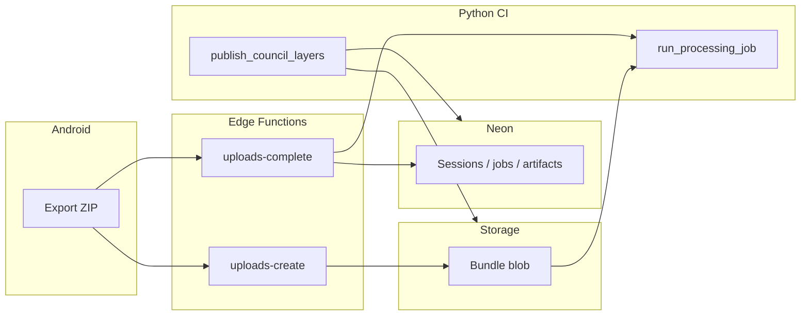

# Backend architecture (hosted alpha)

This document describes the **in-repo hosted alpha foundation**: Neon metadata, Supabase Storage + Edge Functions, Python runners, and CI. The Android app remains **local-first**; cloud paths are **additive** (upload, publish, council reads).

For operator setup (secrets, rotation, CLI), see [setup-hosted-alpha.md](setup-hosted-alpha.md). For HTTP/JSON schemas, see [api-contract.md](api-contract.md).

---

## Goals

- Accept **session export bundles** (ZIP + manifest) from Android without storing large blobs in Postgres.
- Keep **metadata and job state** in **Neon (Postgres)**; Edge Functions connect via **`DATABASE_URL` / `DATABASE_URL_POOLED`**.
- Store ZIPs and published layers in **Supabase Storage** (private buckets); serve uploads via **signed PUT**; serve council layers via Edge Functions using **service role** after **`COUNCIL_READ`** validation.
- Run **publish** and **processing** jobs from Python + GitHub Actions with fail-safe behaviour when secrets are absent.

**Invariant:** OLGX app schema in Neon is the single metadata source for this release; Supabase Postgres (`SUPABASE_DB_*`) is documented but **not** used for duplicate OLGX tables.

---

## Layout (repository)

| Layer | Path | Holds |
|-------|------|-------|
| SQL migrations | `backend/sql/migrations/` | Extensions, councils/projects/devices, sessions, jobs, artifacts, published runs, optional hosted derived tables |
| Edge Functions | `backend/supabase/functions/` | `uploads-create`, `uploads-complete`, `healthz`, `council-layers-*` |
| Shared TS | `backend/supabase/functions/_shared/` | CORS, JSON, errors, env, Neon (`postgres`), auth (hashed API keys), storage path builders |
| Publish | `backend/publish/` | `publish_council_layers.py` — fail-closed without LGA boundary |
| Processing | `backend/processing/` | `run_processing_job.py` — scaffold: download, validate, state machine |
| Road pack | `backend/roadpack-build/` | `build_road_pack.py` — clip, version, checksum, Storage upload, `road_packs` row |
| CI | `.github/workflows/` | Migration check, 12h publish, processing backfill, optional Supabase deploy |

**Rule:** Postgres stores pointers (storage keys), checksums, sizes, state enums—not megabyte-scale sensor dumps as row bodies.

---

## Storage key contract

Path builders are shared conceptually with Python (`backend/publish/libs/paths.py`). Month is always **two-digit** `mm` (UTC).

- `raw/{councilSlug}/{projectSlug}/{deviceId}/{yyyy}/{mm}/{sessionUuid}.zip`
- `filtered/{councilSlug}/{projectSlug}/{deviceId}/{yyyy}/{mm}/{sessionUuid}.zip`
- `roadpacks/{councilSlug}/{version}/public-roads.fgb`
- `published/{councilSlug}/roughness/latest.geojson` (and `anomalies`, `consensus`)
- `published/{councilSlug}/manifest.json`

---

## Identity model

- **Council** → **projects** (`(council_id, slug)` unique).
- **Device** registered per project; **`client_session_uuid`** on server aligns with app `RecordingSessionEntity.uuid`.
- **`api_keys`:** `DEVICE_UPLOAD` (upload endpoints), `COUNCIL_READ` (layer GET), `INTERNAL_ADMIN` (reserved); hashed at rest.

---

## Upload flow (high level)

1. **POST** `uploads-create` — validate body, upsert `recording_sessions`, insert `upload_jobs`, return **signed PUT** for bucket + object key.
2. **PUT** ZIP to Storage using returned URL and headers.
3. **POST** `uploads-complete` — verify size/checksum, finalize job, insert `artifact`, enqueue `processing_jobs` (idempotent).

See [api-contract.md](api-contract.md) for normative JSON.

---

## Worker / process flow

---

## Android integration (summary)

- **Room v5** adds `hostedPipelineState` and extended **`upload_batches`** for upload queue metadata.
- **WorkManager** + Hilt: `SessionUploadWorker` uses OkHttp against `uploads-create` / `uploads-complete`.
- **Settings:** `uploadEnabled`, base URL, API key, retry limits, Wi‑Fi / charging policies, road filter toggles — see `AppSettings` and [road-filtering.md](road-filtering.md).

---

## Council publishing

- **12-hour** scheduled publish; **fail-closed** if LGA boundary missing — see [council-publishing.md](council-publishing.md).
- **Versioned** `manifest.json` under `published/{councilSlug}/`.

---

## Related docs

- [ROADMAP.md](../ROADMAP.md) — phases; **Hosted alpha foundation**
- [README.md](../README.md) — Android capabilities, export schema, build commands
- [Neon pricing](https://neon.com/pricing), [Neon Open Source Program](https://neon.com/programs/open-source)
