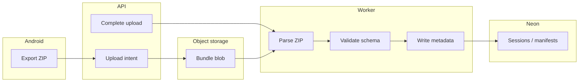

# Backend architecture (planned)

This document sketches the **intended** server-side shape so contributors and agents can align on ingestion, storage, and training data flow. Nothing here is implemented in this repository yet; the Android app remains local-first until Phase 5 in [ROADMAP.md](../ROADMAP.md).

---

## Goals

- Accept **session export bundles** (ZIP + manifest) from the Android app without storing huge blobs in Postgres.
- Keep **metadata and queryable fields** in **Neon (Postgres)**.
- Run **async workers** to parse uploads, optionally re-run or validate processing, and feed labelling/training pipelines later.

---

## Storage split

| Layer | Technology (recommended) | Holds |
|--------|--------------------------|--------|
| Metadata DB | Neon Postgres | Orgs, projects, devices, session rows, upload manifests, label rows, aggregate stats, model version records |
| Object storage | S3-compatible bucket (or vendor equivalent) | Raw ZIP exports, large CSV/JSON artifacts, training snapshots, model binaries |

**Rule:** PostgreSQL stores **pointers** (`s3://…` or HTTPS URLs), checksums, sizes, and parsing-derived columns—not megabyte-scale sensor dumps as row bodies.

---

## Identity model (sketch)

- **Project / org:** tenant boundary for uploads and labels.
- **Device:** stable id (Android app installation or hardware-derived token); linked to project.
- **Recording session:** matches app `RecordingSession` / export `session.json` id and UUID; server row links to manifest and blob keys.

Exact naming should align with the frozen **export manifest** schema (see README export section) when the MVP is built.

---

## Upload API contract (MVP target)

High-level steps:

1. **Create upload intent** — client sends manifest metadata (session id, uuid, byte size, export schema version, checksum). Server returns a **presigned PUT URL** or upload token for the blob.
2. **PUT bundle** — client uploads ZIP to object storage.
3. **Complete upload** — client notifies server; server verifies checksum, enqueues **ingestion job**.
4. **Worker** — job unpacks ZIP, validates files, writes/updates `sessions` and related tables, stores blob paths; optionally triggers server-side reprocessing later.

Authentication for early MVP: **project-scoped API key** or **device-scoped JWT**—to be chosen when implementation starts.

---

## Neon schema (illustrative tables)

Names are indicative; migrate with real SQL when implementing.

- `organizations`, `projects`
- `devices` (project_id, device_public_id, …)
- `recording_sessions` (project_id, device_id, client_session_id, uuid, started_at, ended_at, processing_state, blob_manifest_uri, export_schema_version, …)
- `upload_jobs` (session_id, status, error, created_at, …)
- `labels` (session_id or window/s segment ref, taxonomy, author, created_at, …) — Phase 4+
- `segment_aggregates`, `model_versions`, `validation_runs` — later phases

Derived feature **rows** can mirror on-device tables at a coarse level (counts, summary stats) with optional references back to parquet/CSV in object storage for heavy analytics.

---

## Worker / process flow

Future: optional queue for **recompute derived features** server-side (must not replace raw truth; should be versioned).

---

## Model-training data flow

1. **Curate** labelled sessions in Postgres (Phase 4).
2. **Materialize** training datasets via batch jobs: read manifests → pull blobs → emit versioned dataset in object storage (e.g. Parquet) with a **dataset version** row in Neon.
3. **Train** offline (Python or other) with experiments tracked; store **model version** + metrics in Neon; artifacts in object storage.
4. **Compare** always against the **on-device heuristic baseline** documented in the roadmap.

---

## Related docs

- [ROADMAP.md](../ROADMAP.md) — phased delivery and decisions
- [README.md](../README.md) — current Android capabilities and export shape
- [Neon pricing](https://neon.com/pricing), [Neon Open Source Program](https://neon.com/programs/open-source)
